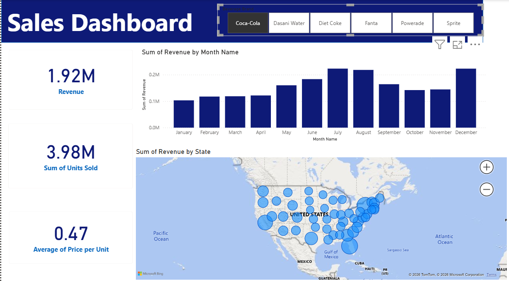

# Beverage Sales Analysis Dashboard

## 📊 Project Overview

An interactive Power BI dashboard developed to analyze beverage sales performance across the United States.

The dashboard provides an overview of revenue, units sold, average price per unit, monthly revenue trends, and state-level sales performance. Users can interact with the dashboard by selecting different beverage brands to explore their individual performance.

## 🎯 Business Objective

The objective of this project was to transform raw sales data into an interactive business intelligence dashboard that makes it easier to monitor sales performance and identify trends across products, time periods, and geographic locations.

## 📈 Key Metrics

The dashboard tracks three core performance indicators:

- **Revenue**
- **Units Sold**
- **Average Price per Unit**

For example, when Coca-Cola is selected, the dashboard displays:

| KPI | Value |
|---|---:|
| Revenue | $1.92M |
| Units Sold | 3.98M |
| Average Price per Unit | $0.47 |

*Values change dynamically based on the selected beverage.*

## 🔍 Analysis Areas

The dashboard provides analysis across:

- **Beverage Performance** – Compare sales performance across beverage brands.
- **Monthly Revenue** – Analyze how revenue changes from January through December.
- **Geographic Performance** – Explore revenue across all 50 U.S. states.
- **KPI Monitoring** – Track revenue, units sold, and average price per unit.

## 🛠 Tools & Techniques

- **Power BI** – Dashboard development and data visualization
- **Power Query** – Data cleaning and transformation
- **Data Modelling** – Structuring data for analysis
- **Interactive Filters** – Beverage-level analysis and exploration

## 🖥 Dashboard Preview

## 💡 Key Takeaway

This project demonstrates the use of Power BI and Power Query to transform raw sales data into an interactive business intelligence dashboard, that supports commercial performance analysis across products, time, and geography.
